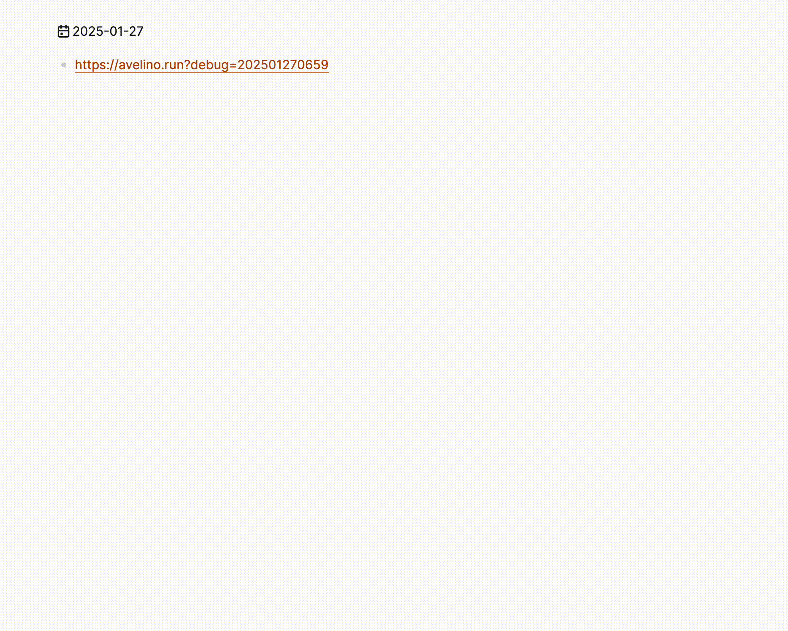

# Summarize Plugin for Logseq by [tldr.chat](https://tldr.chat)

Optimize your time with concise summaries of web pages and YouTube videos.



**Slash Commands:** `/summarize` or `/sum`

## dev setup

> written in [ClojureScript](https://clojurescript.org) with [shadow-cljs](https://github.com/thheller/shadow-cljs) as the main tooling.

Need to have clojure (and java) and [babashka](https://babashka.org/) installed on your machine, you can run the following command to start the development server:

```bash
bb run dev
```

### tldr.chat mock server

```bash
docker run -it \
  -p 8000:8000 -v $(pwd)/moclojer.yml:/app/moclojer.yml \
  ghcr.io/moclojer/moclojer:dev
```
